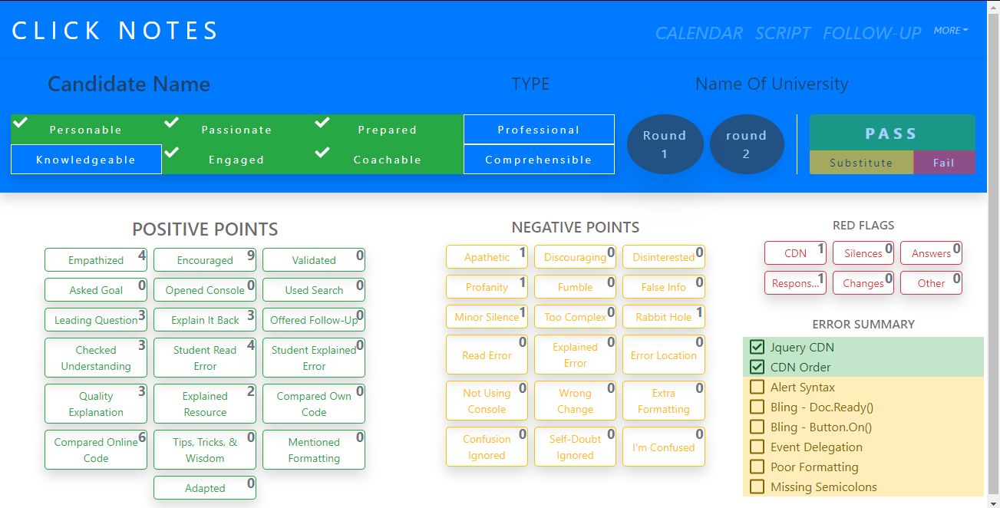

# Click It Notes
[Live Preview](http://clicknotes.com.s3-website.us-east-2.amazonaws.com/)

## OVERVIEW
Click It Notes brings simplicity and automation to the note taking process during our final TA interviews while supporting consistent and quality reports among all team members. Interviewers will have a clean and simple user interface that allows them to click buttons to take notes of the most common behaviors identified during a final TA exercise. When an interview has finished, users can generate a human readable report showing the outcome of their Click It Notes.

## BENEFITS
1. Consistent interview reports.
2. Consistent hiring recommendations.
3. Interviewer won’t appear distracted while taking notes.
4. Quick notes for those who prefer speed of handwritten notes.
5. Interview reviews made easy with added consistency and timestamps.
6. **SAVE THE TREES, MAN!**

## CORE FEATURES
|         |            |
| ------- |:----------|
| 1. List of high-level abilities and desired traits      | 6. Click an item to generate a note            |
| 2. List of positive points                              | 7. Show “pass” script                          |
| 3. List of negative points                              | 8. Show “fail” script                          |
| 4. List of red flags                                    | 9. Generate human readable report              |
| 5. List of code problems and errors                     | 10. Button to copy the report to the clipboard |

## MORE FEATURES

|         |            |
| ------- |:----------|
| 1. Recommend feedback points                    | 5. Prompt user to initiate final feedback |
| 2. Recommend hiring status                      | 6. Prompt user to initiate early feedback |
| 3. Access to SOP, FAQ, etc                      | 7. Integrate with Salesforce              |
| 4. Prompt user to initiate midway feedback      | 8. Integrate with Google Calendar         |

## SCREENSHOTS

